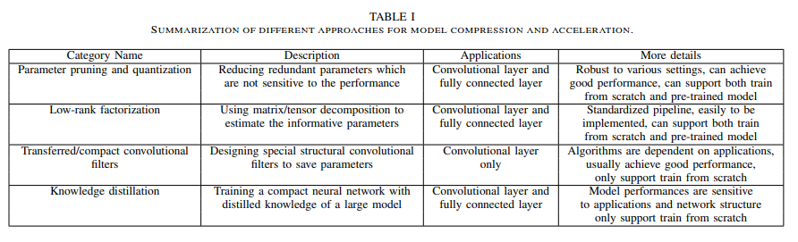

# Optimization techniques

Optimization is a critical component of machine learning as it enables algorithms to learn from data and improve their performance on a given task. In machine learning, optimization refers to the process of adjusting the parameters of a model in order to minimize the difference between the predicted and actual output for a given input.

Optimization techniques for embedded devices are similar to those used in traditional machine learning, but they are specifically tailored to the limitations and requirements of embedded systems. Some common optimization techniques used for embedded devices include:

- [Quantization:](page07.md)

- [Pruning:](page06.md)

- [Compression:](page09.md)

- [Knowledge Distillation:](page08.md)

- [Hardware Acceleration:](page10.md)

Overall, optimization techniques for embedded devices are focused on reducing the size, complexity, and computational requirements of machine learning models, while still maintaining their accuracy and effectiveness.

