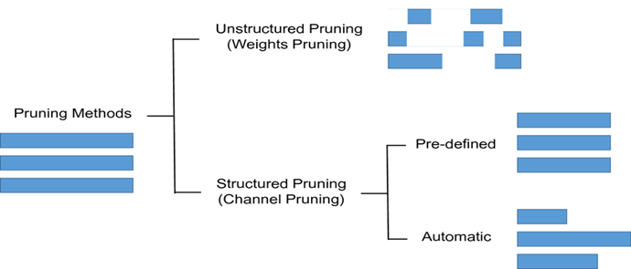

# Pruning

Pruning is a technique used in machine learning to reduce the size and complexity of a trained model. It involves removing unnecessary connections or neurons from a neural network, which can significantly reduce its size and improve its speed, without sacrificing its accuracy.

Pruning can be performed in different ways, such as magnitude-based pruning, where weights with the smallest magnitudes are pruned, or structured pruning, where entire layers or blocks of neurons are pruned based on their importance to the network.

Pruning is usually performed after a model has been trained and can be used in conjunction with other optimization techniques, such as quantization and compression, to further reduce the size and complexity of a model. Pruning can also be applied iteratively, where a model is pruned and then retrained, to achieve even greater reductions in size and complexity.

One advantage of pruning is that it can lead to models that are more efficient and easier to deploy in real-world applications, particularly on embedded devices with limited memory and processing power. Additionally, pruning can also help to reduce the risk of overfitting, where a model becomes too complex and performs poorly on new data. However, it is important to note that pruning can also lead to a decrease in accuracy if too many connections or neurons are removed from the model.

Compression is a technique used in machine learning to reduce the storage requirements of trained models, without significantly impacting their accuracy or performance. It involves using algorithms to compress the weights and activations of a model, which can greatly reduce the amount of memory required to store the model.

Deep Learning models these days require a significant amount of computing, memory, and power which becomes a bottleneck in the conditions where we need real-time inference or to run models on edge devices and browsers with limited computational resources. Energy efficiency is a major concern for current deep learning models.

Pruning is one of the methods for inference to efficiently produce models smaller in size, more memory-efficient, more power-efficient and faster at inference with minimal loss in accuracy, other such techniques being weight sharing and quantization. 


Our first step is to get a couple of imports out of the way:

    -Os and Zipfile will help us in assessing the size of the models.
    -tensorflow_model_optimization for model pruning.
    -load_model for loading a saved model.
    -and of course tensorflow and keras.

finally we'll able to visualize the models:

```python
import os
import zipfile
import tensorflow as tf
import tensorflow_model_optimization as tfmot
from tensorflow.keras.models import load_model
from tensorflow import keras
%load_ext tensorboard 
```

DATASET GENERATION

 For this experiment, we'll genertate a regression datset using sckit-learn. Thereafter, we split the datset into a training and test set:

```python
from sklearn.datasets import make_friedman1
X, y = make_friedman1(n_samples=10000, n_features=10, random_state=0)
from sklearn.model_selection import train_test_split
X_train, X_test, y_train, y_test = train_test_split(X, y, test_size=0.33, random_state=42)
```

MODEL WITHOUT PRUNING

We’ll create a simple neural network to predict the target variable y. Then check the mean squared error. After this, we’ll compare this with the entire model pruned, and then with just the Dense layer pruned.


Next, we step up a callback to stop training the model once it stops improving, after 30 epochs.

```python
     early_stop = keras.callbacks.EarlyStopping(monitor=’val_loss’, patience=30)
```

Let’s print a summary of the model so that we can compare it with the summary of the pruned models.

```python
    model = setup_model()
    model.summary()
```

Let’s compile the model and train it.

```python
    model.compile(optimizer=’adam’,
    loss=tf.keras.losses.mean_squared_error,
    metrics=[‘mae’, ‘mse’])
    model.fit(X_train,y_train,epochs=300,validation_split=0.2,callbacks=early_stop,verbose=0)
```


Check the model summary. Compare this with the summary of the unpruned model.'

```python
    model_to_prune.summary()
```

We have to compile the model before we can fit it to the training and testing set.

```python
    model_to_prune.compile(optimizer=’adam’,
    loss=tf.keras.losses.mean_squared_error,
    metrics=[‘mae’, ‘mse’])
```

Since we’re applying pruning, we have to define a couple of pruning callbacks in addition to the early stopping callback.

```python
   tfmot.sparsity.keras.UpdatePruningStep()
   ```
       Updates pruning wrappers with the optimizer step. Failure to specify it will result in an error.

```python
   tfmot.sparsity.keras.PruningSummaries() 
```
   adds pruning summaries to the Tensorboard.

```python
     log_dir = ‘.models’
    callbacks = [
     tfmot.sparsity.keras.UpdatePruningStep(),
     # Log sparsity and other metrics in Tensorboard.
     tfmot.sparsity.keras.PruningSummaries(log_dir=log_dir),
     keras.callbacks.EarlyStopping(monitor=’val_loss’, patience=10)
    ]
```

With that out of the way, we can now fit the model to the training set.


```python
    model_to_prune.fit(X_train,y_train,epochs=100,validation_split=0.2,callbacks=callbacks,verbose=0)
    Upon checking the mean squared error for this model, we notice that it’s slightly higher than the one for the unpruned model.

    prune_predictions = model_to_prune.predict(X_test)
    print(‘Whole Model Pruned MSE %.4f’ % mean_squared_error(y_test,prune_predictions.reshape(3300,)))
    Whole Model Pruned MSE  0.1830
```

### Types of pruning

#### Structured and Unstructured Pruning
Individual parameters are pruned using an unstructured pruning approach. This results in a sparse neural network, which, while lower in terms of parameter count, may not be configured in a way that promotes speed improvements. 
Randomly zeroing out the parameters saves memory but may not necessarily improve computing performance because we end up conducting the same number of matrix multiplications as before. Because we set specific weights in the weight matrix to zero, this is also known as Weight Pruning.



#### Single-shot pruning / one shot pruning
A one-shot training and pruning framework that compresses a full neural network into a slimmer one with competitive performance by Only-Train-Once. OTO dramatically simplifies the complex multi-stage training pipelines of the existing pruning approaches, fits various architectures and applications, and hence is generic and efficient.
The oneshot pruning approach works like iterative, but uses a prune rate of P=1.0. This means we prune the entire model in one shot reducing it down entirely to a size of [1, 1]. We run oneshot on all of the potential starting points we described in iterative (second approach), then we select the best performing oneshot model.

A simple example of Single shot pruning where the threshold is set to 0.1 
```
import torch
import torch.nn as nn
import torch.optim as optim
import torchvision
import torchvision.transforms as transforms

# Define your neural network model
class Net(nn.Module):
    def __init__(self):
        super(Net, self).__init__()
        self.conv1 = nn.Conv2d(3, 64, kernel_size=3)
        self.conv2 = nn.Conv2d(64, 64, kernel_size=3)
        self.fc1 = nn.Linear(64 * 5 * 5, 384)
        self.fc2 = nn.Linear(384, 10)

    def forward(self, x):
        x = self.conv1(x)
        x = self.conv2(x)
        x = x.view(-1, 64 * 5 * 5)
        x = self.fc1(x)
        x = self.fc2(x)
        return x

# Load your dataset and create data loaders
transform = transforms.Compose(
    [transforms.ToTensor(), transforms.Normalize((0.5, 0.5, 0.5), (0.5, 0.5, 0.5))]
)
trainset = torchvision.datasets.CIFAR10(root='./data', train=True, download=True, transform=transform)
trainloader = torch.utils.data.DataLoader(trainset, batch_size=32, shuffle=True, num_workers=2)

# Train the initial model
device = torch.device("cuda" if torch.cuda.is_available() else "cpu")
net = Net().to(device)
criterion = nn.CrossEntropyLoss()
optimizer = optim.SGD(net.parameters(), lr=0.01, momentum=0.9, weight_decay=5e-4)

def train(net, dataloader, criterion, optimizer, device):
    net.train()
    running_loss = 0.0
    for inputs, labels in dataloader:
        inputs, labels = inputs.to(device), labels.to(device)
        optimizer.zero_grad()
        outputs = net(inputs)
        loss = criterion(outputs, labels)
        loss.backward()
        optimizer.step()
        running_loss += loss.item()
    return running_loss

for epoch in range(10):
    loss = train(net, trainloader, criterion, optimizer, device)
    print(f"Epoch {epoch+1}: Loss = {loss}")

# Compute importance scores (e.g., magnitude-based pruning)
def compute_importance_scores(net, dataloader, device):
    net.eval()
    importance_scores = []
    for inputs, _ in dataloader:
        inputs = inputs.to(device)
        outputs = net(inputs)
        grad_outputs = torch.zeros_like(outputs).to(device)
        outputs.backward(grad_outputs)
        for param in net.parameters():
            if param.grad is not None:
                importance_scores.append(torch.abs(param.grad))
    return torch.cat(importance_scores)

# Prune the network based on importance scores
def prune_network(net, importance_scores, pruning_threshold):
    for name, module in net.named_modules():
        if isinstance(module, nn.Conv2d) or isinstance(module, nn.Linear):
            importance_scores_layer = importance_scores[name]
            mask = importance_scores_layer > pruning_threshold
            module.weight.data *= mask.float()
            if module.bias is not None:
                module.bias.data *= mask.float()

# Fine-tune the pruned model
def fine_tune(net, dataloader, criterion, optimizer, device):
    net.train()
    for epoch in range(5):
        running_loss = 0.0
        for inputs, labels in dataloader:
            inputs, labels = inputs.to(device), labels.to(device)
            optimizer.zero_grad()
            outputs = net(inputs)
            loss = criterion(outputs, labels)
            loss.backward()
            optimizer.step()
            running_loss += loss.item()
        print(f"Fine-tuning Epoch {epoch+1}: Loss = {running_loss}")

# Perform single-shot pruning
pruning_threshold = 0.1
importance_scores = compute_importance_scores(net, trainloader, device)
prune_network(net, importance_scores, pruning_threshold)
fine_tune(net, trainloader, criterion, optimizer, device)
```
This is a simple CNN model with CIFAR-10 dataset

#### Iterative pruning
Iterative Pruning or dynamic pruning repeats the process of pruning the network to some extent and retraining it until the desired pruning rate is obtained.
A simple iterative approach can be thought of as starting with a model size and reducing it slowly until we reach an optimal size based on criteria for accuracy and speed performance. The iterative approach uses a pruning rate P=0.5 (50%).

Here's a code snippet that demonstrates the iterative pruning process using PyTorch:

```
import torch
import torch.nn as nn
import torch.optim as optim
import torchvision
import torchvision.transforms as transforms

# Define your neural network model
class Net(nn.Module):
    def __init__(self):
        super(Net, self).__init__()
        self.fc1 = nn.Linear(784, 300)
        self.fc2 = nn.Linear(300, 100)
        self.fc3 = nn.Linear(100, 10)

    def forward(self, x):
        x = x.view(x.size(0), -1)
        x = self.fc1(x)
        x = self.fc2(x)
        x = self.fc3(x)
        return x

# Load your dataset and create data loaders
transform = transforms.Compose(
    [transforms.ToTensor(), transforms.Normalize((0.5,), (0.5,))]
)
trainset = torchvision.datasets.MNIST(root='./data', train=True, download=True, transform=transform)
trainloader = torch.utils.data.DataLoader(trainset, batch_size=32, shuffle=True, num_workers=2)

# Train the initial model
device = torch.device("cuda" if torch.cuda.is_available() else "cpu")
net = Net().to(device)
criterion = nn.CrossEntropyLoss()
optimizer = optim.SGD(net.parameters(), lr=0.01, momentum=0.9)

def train(net, dataloader, criterion, optimizer, device):
    net.train()
    running_loss = 0.0
    for inputs, labels in dataloader:
        inputs, labels = inputs.to(device), labels.to(device)
        optimizer.zero_grad()
        outputs = net(inputs)
        loss = criterion(outputs, labels)
        loss.backward()
        optimizer.step()
        running_loss += loss.item()
    return running_loss

for epoch in range(10):
    loss = train(net, trainloader, criterion, optimizer, device)
    print(f"Epoch {epoch+1}: Loss = {loss}")

# Compute importance scores (e.g., magnitude-based pruning)
def compute_importance_scores(net, dataloader, device):
    net.eval()
    importance_scores = []
    for inputs, _ in dataloader:
        inputs = inputs.to(device)
        outputs = net(inputs)
        grad_outputs = torch.zeros_like(outputs).to(device)
        outputs.backward(grad_outputs)
        for param in net.parameters():
            if param.grad is not None:
                importance_scores.append(torch.abs(param.grad))
    return torch.cat(importance_scores)

# Prune the network based on importance scores
def prune_network(net, importance_scores, pruning_rate):
    flat_scores = importance_scores.flatten()
    k = int(len(flat_scores) * pruning_rate)
    threshold = torch.topk(flat_scores, k).values.min()
    
    for name, module in net.named_modules():
        if isinstance(module, nn.Linear):
            importance_scores_layer = importance_scores[name]
            mask = importance_scores_layer > threshold
            module.weight.data *= mask.float()
            if module.bias is not None:
                module.bias.data *= mask.float()

# Fine-tune the pruned model
def fine_tune(net, dataloader, criterion, optimizer, device):
    net.train()
    for epoch in range(5):
        running_loss = 0.0
        for inputs, labels in dataloader:
            inputs, labels = inputs.to(device), labels.to(device)
            optimizer.zero_grad()
            outputs = net(inputs)
            loss = criterion(outputs, labels)
            loss.backward()
            optimizer.step()
            running_loss += loss.item()
        print(f"Fine-tuning Epoch {epoch+1}: Loss = {running_loss}")

# Perform iterative pruning
pruning_rate = 0.2
num_iterations = 5

for iteration in range(num_iterations):
    importance_scores = compute_importance_scores(net, trainloader, device)
    prune_network(net, importance_scores, pruning_rate)
    fine_tune(net, trainloader, criterion, optimizer, device)
```
In this example, we use the MNIST dataset and a simple fully connected neural network model.


### Comparision of the accuracy of Single shot pruning and Iterative pruning in various models


## Advantages of Single-shot and Iterative Pruning

The choice between single-shot pruning and iterative pruning depends on various factors, including the specific requirements of your task, the available computational resources, and the desired balance between model size and accuracy. Both approaches have their advantages and considerations:

#### Single-shot pruning:

* **Simplicity:** Single-shot pruning involves pruning the network in a single pass, which can be simpler to implement compared to the iterative approach.
* **Reduced computational cost:** Since single-shot pruning requires only one pass, it can be computationally more efficient compared to iterative pruning, which involves multiple passes of pruning and fine-tuning.
* **Fixed model size:** Single-shot pruning provides a fixed and known model size after pruning, making it easier to deploy and manage the pruned model.

#### Iterative pruning:

* **Better accuracy retention:** Iterative pruning allows for gradual pruning, which can help maintain or recover model accuracy more effectively. It provides an opportunity to fine-tune the model after each pruning step, reducing the impact on accuracy compared to single-shot pruning.
* **More aggressive pruning:** Iterative pruning allows for multiple iterations, enabling more aggressive pruning and potentially achieving higher compression rates.
* **Adaptive pruning:** With iterative pruning, you can adaptively adjust the pruning threshold or rate based on the model's performance during the pruning process, leading to potentially better results.


## Conclusion
Single-shot pruning is a simpler and computationally more efficient approach, while iterative pruning offers better accuracy retention and the ability to achieve higher compression rates. The choice between them depends on the specific trade-offs and priorities for your particular use case. It's often recommended to experiment with both approaches and evaluate their impact on accuracy, model size, and computational requirements to determine the most suitable pruning method for your needs.