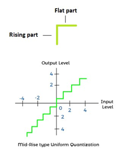
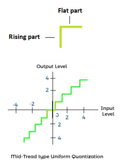
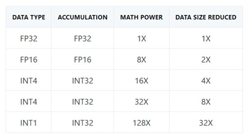
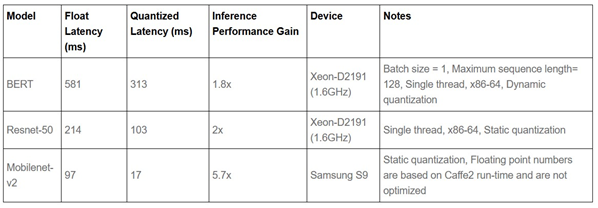
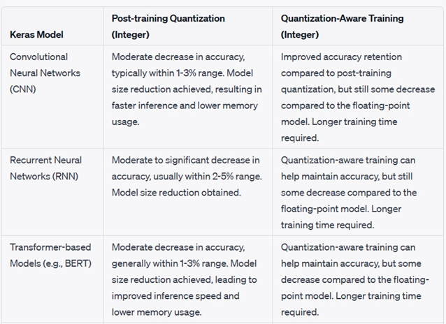
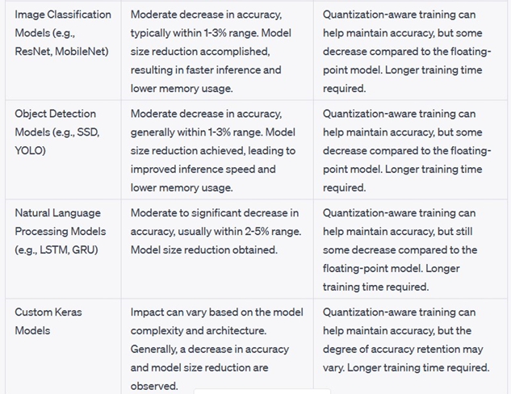

# Quantization

This document aims to provide an overview of quantization, its importance, and its objectives in reducing data size, computational complexity, and memory requirements. By understanding quantization, you'll gain insights into a fundamental technique used in signal processing, data compression, and optimization.

## Definition of Quantization and Key Objectives:

Quantization is a process that involves mapping a continuous range of values to a discrete set of values. The main objectives of quantization include:
Data Size Reduction:
 Quantization reduces the number of bits required to represent a given set of data. By mapping data to a smaller set of discrete values, the size of the data representation is reduced, leading to efficient storage and transmission.
Computational Complexity Reduction: 
Quantization reduces the precision or granularity of data, which can significantly reduce the computational complexity of processing operations. This is particularly important in computationally intensive tasks where high precision is not always necessary.
Memory Requirement Optimization: 
By representing data with fewer bits, quantization helps optimize memory utilization. This is especially valuable in scenarios where memory resources are limited, such as in embedded systems or mobile devices.
Trade-off between Accuracy and Efficiency: 
Quantization involves a trade-off between preserving data accuracy and achieving efficiency gains. The challenge lies in finding the right balance between reducing data size and maintaining an acceptable level of fidelity in the reconstructed signal.
By achieving these objectives, quantization enables the efficient storage, transmission, and processing of data, making it a valuable technique in various fields. In the following sections of this document, we will explore quantization techniques, frameworks, and their applications in greater detail, providing insights into how quantization is implemented and its impact in specific domains.

## Importance of Quantization:

Quantization plays a crucial role in a wide range of domains, including signal processing, data compression, machine learning, and embedded systems. Here are some reasons why quantization is important:
Efficient Storage and Transmission: In many applications, data needs to be stored or transmitted efficiently. Quantization allows for the reduction of data size, enabling more compact representation and efficient utilization of storage space or network bandwidth.
Computational Complexity Reduction: High-precision computations can be computationally intensive and resource-consuming. By reducing the precision of data through quantization, the computational complexity can be significantly reduced, leading to faster and more efficient processing.
Memory Requirement Optimization: Memory usage is a critical consideration, especially in resource-constrained systems. Quantization reduces the memory requirements by representing data with fewer bits, allowing for optimized memory utilization.
Hardware Implementation: In embedded systems or hardware accelerators, quantization enables the implementation of efficient algorithms using fixed-point arithmetic, which is more suitable for hardware implementations compared to floating-point operations.

## Basics of Quantization:

Quantization is a fundamental concept in signal processing, data compression, and machine learning. It involves converting continuous and often analog data into a discrete representation. Let's explore the key concepts associated with quantization:
Discretization of Continuous Data: Quantization involves dividing a continuous range of values into a finite number of discrete levels or bins. This allows us to represent the data using a limited set of values, resulting in a digital representation that can be processed, stored, or transmitted more efficiently.
Representation of Discrete Levels: In quantization, the continuous data is mapped to the nearest discrete level within the defined set of quantization levels. Each level represents a range of values, and the data point is assigned to the closest level. The number of quantization levels determines the precision of the quantization.
Quantization Error: Quantization introduces an inherent error called quantization error. It is the difference between the original value and its quantized representation. The quantization error arises because the discrete levels cannot precisely represent the infinite possibilities of the original continuous data. Minimizing quantization error is a key objective in quantization techniques.
Impact on Fidelity: The quantization error has an impact on the fidelity or accuracy of the reconstructed data. Higher precision quantization (using more levels) can reduce the quantization error and preserve fidelity but requires more bits for representation. On the other hand, lower precision quantization (using fewer levels) reduces fidelity but offers higher efficiency in terms of storage, transmission, or computation.

## Role of Quantization:

Signal Processing: In signal processing, quantization is used to convert analog signals into digital representations. It is a fundamental step in analog-to-digital conversion, enabling further processing and manipulation of signals in digital systems.
Data Compression: Quantization plays a crucial role in data compression techniques. By reducing the precision of data, quantization allows for more efficient compression algorithms, as the reduced number of bits required for representation leads to smaller file sizes or reduced transmission bandwidth.
Machine Learning: In machine learning, quantization is employed to optimize the deployment of models on resource-constrained devices. Quantizing the model parameters and activations reduces memory usage and computational complexity, enabling efficient inference on edge devices without sacrificing too much accuracy.
Quantization is a powerful technique that strikes a balance between efficient utilization of resources and maintaining an acceptable level of fidelity in various domains. Understanding the basics of quantization helps in exploring more advanced quantization methods and their applications in signal processing, data compression, and machine learning tasks.

## Types of Quantization:

Uniform Quantization: As the name implies, the quantized levels in the uniform quantization process are equally spaced. The uniform quantization is further categorized as mid-rise type uniform quantization and mid-tread type uniform quantization. Both the uniform quantization processes are symmetric about the respective axis.

Mid-rise type uniform Quantization: Rise refers to the rising part. The origin of the discrete quantized signal lies in the middle of the rising part of the stair like graph, as shown below:

Mid-tread type uniform Quantization: Tread refers to the flat part. The origin of the discrete quantized signal lies in the middle of the tread part of the stair like graph, as shown below:

## Quantization Frameworks

Quantization frameworks include TensorFlow with TensorFlow Model Optimization Toolkit, PyTorch with TorchVision, and ONNX Runtime. These frameworks provide a comprehensive set of tools and resources to simplify the process of quantizing models and deploying them on resource-constrained devices.

## Framework 1: TensorFlow

TensorFlow's quantization capabilities are not limited to specific model architectures. The TensorFlow Model Optimization Toolkit supports quantization for a wide range of models. 
By leveraging TensorFlow's quantization support, developers can optimize their models for deployment on devices with limited computational resources, such as mobile phones, edge devices, or embedded systems. The quantized models achieve a balance between accuracy and efficiency, enabling efficient inference while minimizing memory usage and computational requirements.

## Quantization Techniques:

#### Post-training Quantization:
Post-training quantization is a technique that involves converting pre-trained floating-point models into quantized formats. This technique allows models to be optimized without retraining. TensorFlow provides various methods for post-training quantization, including:
Integer Quantization: Integer quantization is a widely used post-training quantization technique. It reduces the precision of model weights and activations by mapping them to a fixed set of integers. Integer quantization is performed on a per-layer or per-tensor basis, resulting in models that use fixed-point representations. This reduces model size and memory usage, enabling faster inference on devices with limited computational resources.
Dynamic Range Quantization: Dynamic range quantization is a technique that quantizes the weights and activations of the model based on their dynamic range. It uses histogram information to determine the optimal quantization ranges for each layer or tensor. Dynamic range quantization allows for fine-grained precision adjustment, resulting in more efficient models while maintaining reasonable accuracy.
Full Integer Quantization: Full integer quantization extends integer quantization by quantizing the weights, activations, and gradients to integers. It eliminates the need for floating-point operations during inference, leading to further performance improvements on hardware platforms that support integer operations.
#### Quantization-Aware Training:
Quantization-aware training is a technique that trains models with quantization effects considered. It aims to minimize the accuracy loss caused by quantization by incorporating quantization-aware algorithms and simulations during the training process. TensorFlow provides tools and APIs to enable quantization-aware training, which allows models to learn and adapt to the quantization process.
Fake Quantization: Fake quantization is a key component of quantization-aware training. It simulates the effects of quantization during forward and backward passes of the training process. Fake quantization replaces the actual quantization operations with non-learnable quantization functions that approximate the behavior of quantization during training. This allows the model to adjust and optimize its weights and activations to better handle quantization effects.
Fine-Tuning: After quantization-aware training, fine-tuning techniques can be applied to further refine the quantized model. Fine-tuning involves training the quantized model with additional data or adjusting hyperparameters to improve accuracy while preserving the benefits of quantization.

## Framework 2: PyTorch

PyTorch offers built-in capabilities to support the quantization of models. It provides tools and functions through its TorchVision library, which focuses on computer vision tasks and includes various functionalities for model quantization.

## Quantization Techniques:

PyTorch's quantization support includes two main techniques: post-training static quantization and quantization-aware training.
#### Post-training Static Quantization:
Post-training static quantization is a technique that converts pre-trained floating-point models into quantized formats. PyTorch's static quantization allows developers to quantize their models without retraining. This technique involves analyzing the model to determine optimal quantization parameters and then quantizing the weights and activations accordingly. The quantization process reduces the precision of the model parameters and activations, resulting in lower memory usage and improved inference efficiency on hardware platforms that support quantized operations.
#### Quantization-Aware Training:
PyTorch supports quantization-aware training, which allows models to be trained with quantization effects considered. By incorporating quantization-aware algorithms and simulations during the training process, models can learn to be robust to the effects of quantization. This technique minimizes the accuracy loss caused by quantization by training the model with quantization in mind, effectively optimizing the model to handle lower precision representations.

#### Results of the Pytorch Models:

## Framework 3: ONNX Runtime

ONNX Runtime supports the quantization of models in the ONNX format. It provides capabilities for converting and executing quantized models on hardware platforms that support quantized operations, such as CPUs, GPUs, and specialized accelerators.
With ONNX Runtime, developers can take advantage of quantization techniques to optimize their models for deployment on resource-constrained devices. The ability to execute quantized models efficiently across different hardware platforms makes ONNX Runtime a valuable framework for deploying quantized models in diverse real-world scenarios.

## Quantization Techniques:

Pre-processing is to transform a float32 model to prepare it for quantization. It consists of the following three optional steps:Symbolic shape inference. This is best suited for transformer models.
#### Model optimization: 
This step uses ONNX Runtime native library to rewrite the computation graph, including merging computation nodes, eliminating redundancies to improve runtime efficiency.ONNX shape inference.
#### Dynamic Quantization:
 Dynamic quantization calculates the quantization parameters (scale and zero point) for activations dynamically. These calculations increase the cost of inference, while usually achieve higher accuracy comparing to static ones.
Python API for dynamic quantization is in module onnxruntime.quantization.quantize, function quantize_dynamic()
#### Static Quantization:
Static quantization method first runs the model using a set of inputs called calibration data. During these runs, we compute the quantization parameters for each activations. These quantization parameters are written as constants to the quantized model and used for all inputs. Our quantization tool supports three calibration methods: MinMax, Entropy and Percentile. Please refer to calibrate.py for details.
Python API for static quantization is in module onnxruntime.quantization.quantize, function quantize_static(). Please refer to quantize.py for details.
#### Quantization Debugging:
Quantization is not a loss-less transformation. It may negatively affect a model’s accuracy. A solution to this problem is to compare the weights and activations tensors of the original computation graph vs those of the quantized one, identify where they differ most, and avoid quantizing these tensors, or choose another quantization/calibration method. This is called quantization debugging. To facilitate this process, we provide Python APIs for matching weights and activation tensors between a float32 model and its quantized counterpart.
API for debugging is in module onnxruntime.quantization.qdq_loss_debug, which has the following functions:
Function create_weight_matching(). It takes a float32 model and its quantized model, and output a dictionary that matches the corresponding weights between these two models.
Function modify_model_output_intermediate_tensors(). It takes a float32 or quantized model, and augment it to save all its activations.
Function collect_activations(). It takes a model augmented by modify_model_output_intermediate_tensors(), and an input data reader, runs the augmented model to collect all the activations.
Function create_activation_matching(). You can imagine that you run collect_activations(modify_model_output_intermediate_tensors()) on both the float32 and its quantized model, to collect two sets of activations. This function takes these two set of activations, and matches up corresponding ones, so that they can be easily compared by the user.

## Framework 4: Caffe:

Caffe's focus on efficiency and modularity makes it a suitable framework for quantizing models, especially in computer vision applications. By utilizing Caffe's quantization capabilities, developers can achieve optimized models that strike a balance between memory usage, computational efficiency, and inference speed, making them well-suited for deployment on resource-constrained devices.

## Quantization Techniques:

#### Weight Quantization:
Caffe supports weight quantization, where the precision of the model's weights is reduced. This involves converting the weights, which are typically stored as floating-point values, into lower precision representations such as fixed-point or integer formats. By quantizing the weights, the memory footprint of the model is reduced, enabling more efficient storage and faster computations.
#### Activation Quantization:
Caffe also supports activation quantization, which reduces the precision of the model's activations during inference. Similar to weight quantization, activation quantization involves converting the floating-point activations into lower precision formats. This reduces memory usage and computational requirements, leading to faster inference on devices with limited resources.
#### Dynamic Fixed Point (DFP) Quantization:
Caffe provides the Dynamic Fixed Point (DFP) quantization method. DFP quantization allows for the specification of different bit precisions for weights and activations, giving flexibility in optimizing the model for different hardware platforms. It supports fine-grained control over precision, enabling efficient utilization of available resources while maintaining reasonable accuracy.
#### Network-Specific Quantization:
Caffe allows for network-specific quantization, where quantization parameters can be customized for specific layers or parts of the network. This flexibility enables developers to optimize different sections of the model based on their requirements and resource constraints. For example, layers that are more critical for accuracy can be quantized with higher precision, while less critical layers can be quantized more aggressively.
By leveraging these quantization techniques in Caffe, developers can achieve models that are optimized for deployment on resource-constrained devices. The reduced precision of weights and activations significantly reduces memory usage, enhances computational efficiency, and enables faster inference while maintaining reasonable accuracy.

## Quantizations Comparision of frameworks:

