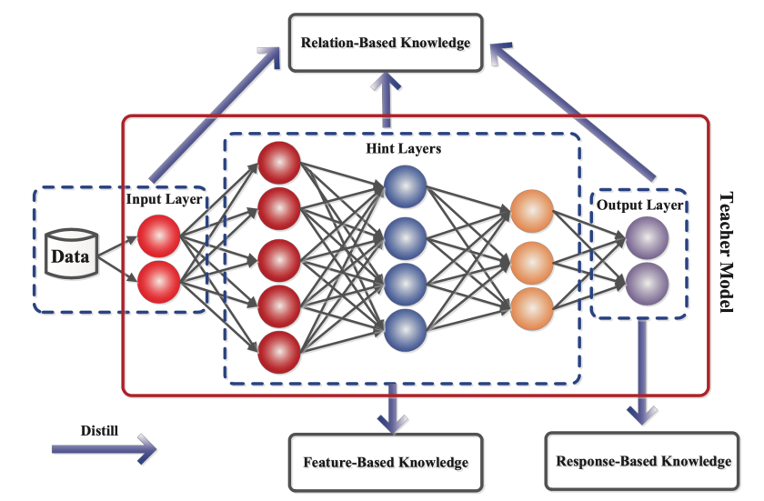
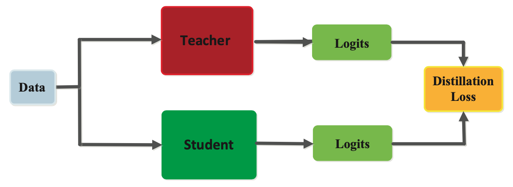
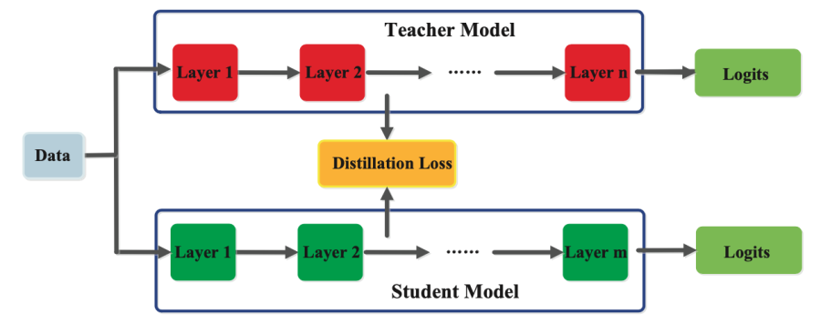
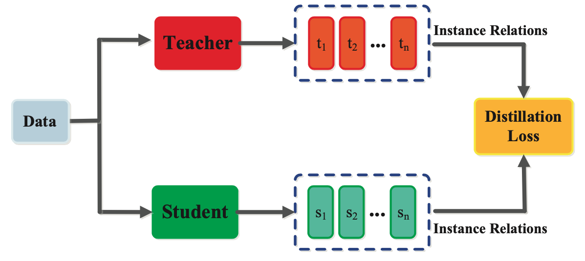
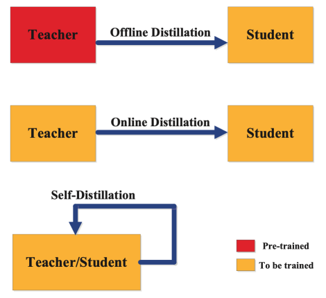

# Knowledge Distillation

Knowledge Distillation is a technique used in machine learning to transfer the knowledge from a large, complex model to a smaller, simpler model. It involves training the smaller model to mimic the output of the larger model, by learning from the soft targets (probabilistic predictions) generated by the larger model, rather than the hard targets (actual labels) in the training data.

The main idea behind knowledge distillation is that a large, complex model has learned to capture the underlying patterns and structure in the data, which can be transferred to a smaller, simpler model through the soft targets generated by the larger model. By training the smaller model to mimic the output of the larger model, the smaller model can achieve comparable performance to the larger model, while using fewer resources and being more computationally efficient.

Knowledge Distillation is typically performed after a large, complex model has been trained and can be used to create a smaller model that is optimized for deployment in scenarios with limited computational resources, such as mobile devices or IoT devices. In addition to reducing the size and complexity of a model, knowledge distillation can also help to reduce overfitting, as the smaller model is trained to learn from the soft targets generated by the larger model, which can be more robust to noisy or incomplete data.

Overall, knowledge distillation is a powerful technique for transferring knowledge from a large, complex model to a smaller, simpler model, while maintaining the performance and accuracy of the original model.

## The different kinds of knowledge in a teacher model

### 1. Response-based knowledge

As shown in Figure 2, response-based knowledge focuses on the final output layer of the teacher model. The hypothesis is that the student model will learn to mimic the predictions of the teacher model. As illustrated in Figure 3, This can be achieved by using a loss function, termed the distillation loss, that captures the difference between the logits of the student and the teacher model respectively. As this loss is minimized over training, the student model will become better at making the same predictions as the teacher.

In the context of computer vision tasks like image classification, the soft targets comprise the response-based knowledge. Soft targets represent the probability distribution over the output classes and typically estimated using a softmax function. Each soft target’s contribution to the knowledge is modulated using a parameter called temperature. Response-based knowledge distillation based on soft targets is usually used in the context of supervised learning.

### 2. Feature-based knowledge

A trained teacher model also captures knowledge of the data in its intermediate layers, which is especially pertinent for deep neural networks. The intermediate layers learn to discriminate specific features and this knowledge can be used to train a student model. As shown in Figure 4, the goal is to train the student model to learn the same feature activations as the teacher model. The distillation loss function achieves this by minimizing the difference between the feature activations of the teacher and the student models.

### 3. Relation-based knowledge

In addition to knowledge represented in the output layers and the intermediate layers of a neural network, knowledge that captures the relationship between feature maps can also be used to train a student model. This form of knowledge, termed as relation-based knowledge is depicted in Figure 5. This relationship can be modeled as correlation between feature maps, graphs, similarity matrix, feature embeddings, or probabilistic distributions based on feature representations.

## Training

There are three principal types of methods for training student and teacher models, namely offline, online and self distillation. The categorization of the distillation training methods depends on whether the teacher model is modified at the same time as the student model or not

### 1. Offline distillation

Offline distillation is the most common method, where a pre-trained teacher model is used to guide the student model. In this scheme, the teacher model is first pre-trained on a training dataset, and then knowledge from the teacher model is distilled to train the student model. Given the recent advances in deep learning, a wide variety of pre-trained neural network models are openly available that can serve as the teacher depending on the use case. Offline distillation is an established technique in deep learning and easier to implement.

### 2. Online distillation

In offline distillation, the pre-trained teacher model is usually a large capacity deep neural network. For several use cases, a pre-trained model may not be available for offline distillation. To address this limitation, online distillation can be used where both the teacher and student models are updated simultaneously in a single end-to-end training process. Online distillation can be operationalized using parallel computing thus making it a highly efficient method.

### 3. Self-distillation

As shown in Figure 6, in self-distillation, the same model is used for the teacher and the student models. For instance, knowledge from deeper layers of a deep neural network can be used to train the shallow layers. It can be considered a special case of online distillation, and instantiated in several ways. Knowledge from earlier epochs of the teacher model can be transferred to its later epochs to train the student model.

## Architecture

The design of the student-teacher network architecture is critical for efficient knowledge acquisition and distillation. Typically, there is a model capacity gap between the more complex teacher model and the simpler student model. This structural gap can be reduced through optimizing knowledge transfer via efficient student-teacher architectures.

Transferring knowledge from deep neural networks is not straightforward due to their depth as well as breadth. The most common architectures for knowledge transfer include a student model that is:

a shallower version of the teacher model with fewer layers and fewer neurons per layer,
a quantized version of the teacher model,
a smaller network with efficient basic operations,
a smaller networks with optimized global network architecture,
the same model as the teacher.
In addition to the above methods, recent advances like neural architecture search can also be employed for designing an optimal student model architecture given a particular teacher model.
