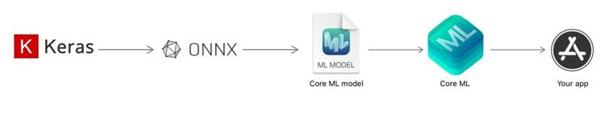
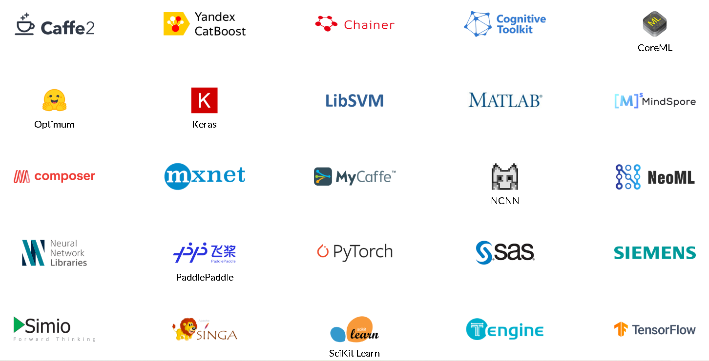
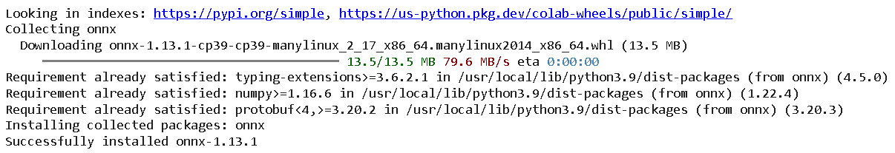
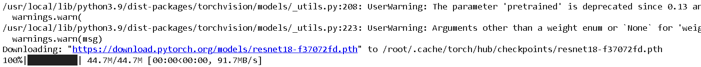
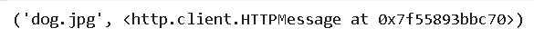
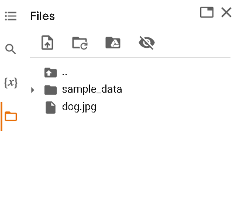
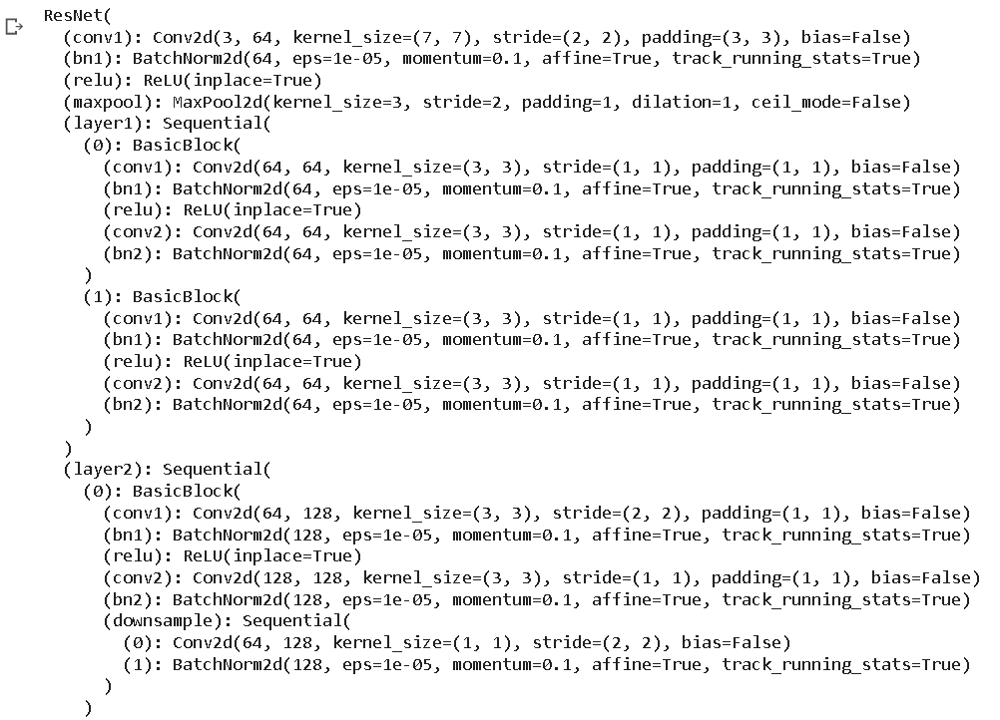

# ONNX

ONNX, or Open Neural Network Exchange, is an **open-source** standard for representing deep learning models. It was developed by Facebook and Microsoft in order to make it easier for researchers and engineers to move models between different deep-learning frameworks and hardware platforms.

it allows models to be easily exported from one framework, such as PyTorch, and imported into another framework, such as TensorFlow. This can be especially useful for researchers who want to try out different frameworks for training and deploying their models

ONNX also provides a set of tools for optimizing and quantizing models, which can help to reduce the memory and computational requirements of the model. This can be especially useful for deploying models on edge devices and other resource-constrained environments.

Another important feature of ONNX is that it is supported by a wide range of companies and organizations. This includes not only Facebook and Microsoft, but also companies like Amazon, NVIDIA, and Intel. This wide range of support ensures that ONNX will continue to be actively developed and maintained, making it a robust and stable standard for representing deep learning models.
  
  -ONNX Runtime is an open-source inference engine for executing ONNX (Open Neural Network Exchange) models. It is designed   to be high-performance and lightweight, making it well-suited for deployment on a wide range of hardware  platforms, including edge devices, servers, and cloud services.
  
  -The ONNX Runtime provides a C++ API, a C# API, and a Python API for executing ONNX models. It also provides support for 
   multiple backends, including CUDA and OpenCL, which allows it to run on a wide range of hardware platforms, such as NVIDIA GPUs and Intel CPUs.
  
  -ONNX Runtime can be very useful since you can use models in inference with a single framework no matter what hardware you 
   are going to use. So without having to actually rewrite the code depending on whether we want to use a CPU, GPU, FPGA or 
   whatever.
  
  -ONNX Runtime also provides support for a wide range of models, including both traditional machine learning models and deep learning models. 
  
  -One of the main advantages of ONNX Runtime is its performance. It uses various techniques such as Just-In-Time (JIT) compilation, kernel fusion and subgraph partitioning to optimize the performance of the model. It also supports thread pooling and inter-node communication for distributed deployment which makes it a suitable choice for large-scale deployment. -One of the main advantages of ONNX Runtime is its performance. It uses various techniques such as Just-In-Time (JIT) compilation, kernel fusion and subgraph partitioning to optimize the performance of the model. It also supports thread pooling and inter-node communication for distributed deployment which makes it a suitable choice for large-scale deployment.
 
FOR EXAMPLE:

Let us look at an example scenario where your goal is to deploy your trained model via an iOS app. You are comfortable putting together neural network models in Keras, an easy-to-use interface for the TensorFlow framework. Your journey starts by understanding the hardware through which your app gets used by the user. Modern Apple devices come with Apple Neural Engine (ANE) as part of the chip. 

The A15 Bionic chip on iPhone 14 comes with 6-core CPU, 5-core GPU, and a 16-core Neural Engine (ANE). On this device, your deep learning model can work on CPU only, CPU and GPU, or all computing engines (CPU, GPU, and ANE). ANE is the fastest way to run your model, especially for heavy applications. On iOS, CoreML is the framework that is optimized for deep learning inference. Also, CoreML is built into the operating system which means there is no need for you to compile, link, or ship your ML binary libraries with the app.

Now that your target framework is defined, you need to find a way to convert your trained model into Core ML. This task can be easily achieved via ONNX - convert your Keras model to ONNX using the tf2onnx library and convert ONNX to Core ML model using the onnx-coreml library in python.  The Core ML model is now ready to be deployed into your app.


## BUILD ONNX FROM SOURCE
Before building from source uninstall any existing versions of onnx pip uninstall onnx.

c++17 or higher C++ compiler version is required to build ONNX from source on Windows. For other platforms, please use C++11 or higher versions.


Windows
If you are building ONNX from source, it is recommended that you also build Protobuf locally as a static library. The version distributed with conda-forge is a DLL, but ONNX expects it to be a static library. Building protobuf locally also lets you control the version of protobuf. The tested and recommended version is 3.20.2.

The instructions in this README assume you are using Visual Studio. It is recommended that you run all the commands from a shell started from "x64 Native Tools Command Prompt for VS 2019" and keep the build system generator for cmake (e.g., cmake -G "Visual Studio 16 2019") consistent while building protobuf as well as ONNX.



## CONVERSION STEPS
-> All frameworks have their own way to convert their models to ONNX. But there are some common steps that you need to follow.only saving the model weighs we ll not be able to convert to ONNX,the model architecture is required and really important to convert your model to onnx.
-> Model weights are the weights of the different layers which are used to compute the output of the model. So, they are equally important to successfully convert the model.
# input names and output names
-> we will need to define the input names and the output names of our model. These metadata are used to describe the inputs and outputs of your model.
 ONNX will trace the different layers of your model in order to create a graph of theses layers.
-> While tracing the layers, ONNX will also need an input sample to understand how the model is working and what operators are used to compute the outputs.
-> The selected sample will be the input of the first layer of the model and is also used to define the input shape of the model.
# dynamic axes
->Then, ONNX requires to know the dynamic axes of your model. Most of the time during the conversion, you will use a batch size of 1.
->But if you want to have a model that can take a batch of N samples, you will need to define the dynamic axes of your model to accept a batch of N samples.
# conversion evaluation
Finally, we need to evaluate the converted model to ensure that it is a sustainable ONNX model and it is working as expected. There are two separate steps to evaluate the converted model.

The first step is to use the ONNX’s API to check the model’s validity. This is done by calling the onnx.checker.check_model function. This will verify the model’s structure and confirm if the model has a valid ONNX scheme or not.

Each node in the model is evaluated by checking the inputs and outputs of the node.

The second step is to compare the output of the converted model with the output of the original model. This is done by comparing both outputs with the numpy.testing.assert_allclose function.
This function will compare the two outputs and will raise an error if the two outputs are not equal, based on the rtol and atol parameters.
```
import torch
import torchvision
from PIL import Image
import numpy as np
```
```
!pip3 install onnx
```


~*here we will load the pretrained ResNet18:*
```
resnet = torchvision.models.resnet18(pretrained=True)
```



~*We will download an example image from PyTorhc*
```
import urllib
url, filename = ("https://github.com/pytorch/hub/raw/master/images/dog.jpg", "dog.jpg") # Notebook Link will be in description
urllib.request.urlretrieve(url, filename)
```


```
from torchvision import transforms
inp_image = Image.open('/content/dog.jpg')
```

```
preprocess = transforms.Compose([
                                 transforms.Resize(256),
                                 transforms.CenterCrop(224),
                                 transforms.ToTensor(),
                                 transforms.Normalize(mean=[0.485, 0.456, 0.406], std=[0.229, 0.224, 0.225])
])
```

```
input_tensor = preprocess(inp_image)
inp_batch = input_tensor.unsqueeze(0)
```
```
device =torch.device("cuda" if torch.cuda.is_available() else "cpu")
inp_batch.to(device)
resnet.to(device)
```
```
with torch.no_grad():
  output = resnet(inp_batch)
print(output[0])
```
~*Output of shape 1000, confidence scores for each of the imagenet classes*
```
import torch.onnx
torch.onnx.export(resnet,
                  inp_batch,
                  "resnet18.onnx",
                  export_params=True,
                  opset_version=10)
```
