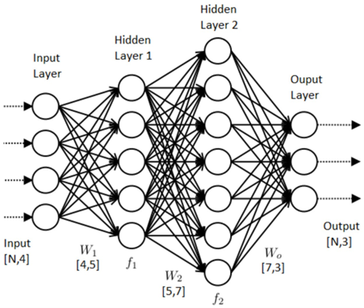
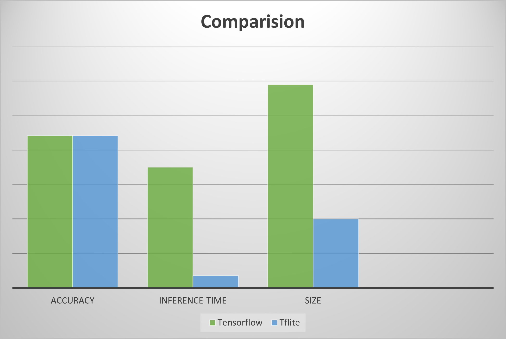

# Model Compression with TensorFlow Lite: A Look into Reducing Model Size

#### Why is Model Compression important?

A significant problem in the arms race to produce more accurate models is complexity, which leads to the problem of size. These models are usually huge and resource-intensive, which leads to greater space and time consumption. (Takes up more space in memory and slower in prediction as compared to smaller models)

#### The Problem of Model Size

A large model size is a common by product when attempting to push the limits of model accuracy in predicting unseen data in deep learning applications. For example, with more nodes, we can detect subtler features in the dataset. However, for project requirements such as using AI in embedded systems that depend on fast predictions, we are limited by the available computational resources. Furthermore, prevailing edge devices do not have networking capabilities, as such, we are not able to utilize cloud computing. This results in the inability to use massive models which would take too long to get meaningful predictions.
As such, we will need to optimize our performance to size, when designing our model.

#### An intuitive understanding of the theory

To overly simplify for the gist of understanding machine learning models, a neural network is a set of nodes with weights(W) that connect between nodes. You can think of this as a set of instructions that we optimize to increase our likelihood of generating our desired class. The more specific this set of instructions are, the greater our model size, which is dependent on the size of our parameters (our configuration variables such as weight).



#### TensorFlow Lite to the rescue!
TensorFlow Lite deals with the Quantisation and prunning and does a great job in abstracting the hard parts of model compression.
TensorFlow Lite covers:
*   Post-Training Quantization— Reduce Float16— Hybrid Quantization— Integer Quantization
*   During-Training Quantization
*   Post-Training Pruning
*   Post-Training Clustering
The most common and easiest to implement method would be post-training quantization. The usage of quantization is the limiting of the bits of precision of our model parameters as such this reduces the amount of data that is needed to be stored.

#### Quantisation

Artificial neural networks consist of activation nodes, the connections between the nodes, and a weight parameter associated with each connection. It is these weight parameters and activation node computations that can be quantized. For perspective, running a neural network on hardware can easily result in many millions of multiplication and addition operations. Lower-bit mathematical operations with quantized parameters combined with quantizing intermediate calculations of a neural network results in large computational gains and higher performance.

Besides the performance benefit, quantized neural networks also increase power efficiency for two reasons: reduced memory access costs and increased compute efficiency. Using the lower-bit quantized data requires less data movement, both on-chip and off-chip, which reduces memory bandwidth and saves significant energy. Lower-precision mathematical operations, such as an 32-bit integer multiply versus a 64-bit floating point multiply, consume less energy and increase compute efficiency, thus reducing power consumption. In addition, reducing the number of bits for representing the neural network’s parameters results in less memory storage. 
   
I will only go through post-training Hybrid/Dynamic range quantization because it is the easiest to implement, has a great amount of impact in size reduction with minimal loss.

To reference our earlier neural network diagram, our model parameters(weights) which refer to the lines connecting each note can be seen to represent its literal weight(significance) or the importance of the node to predict our desired outcome.

Originally, we gave **64-bits** to each weight, known as the tf.float64(64-bit single-precision floating-point), to reduce the size of our model, we would essentially shave off from **64-bits** to **32-bits**(tf.float32) or **16-bits**( tf.float16) depending on the type of quantization used.

We can intuitively see that this poses significant exponential size reductions as with a bigger and more complex the model, the greater the number of nodes and subsequently the greater number of weights which leads to a more significant size reduction especially for fully-connected neural networks, which has each layer of nodes connected to each of the nodes in the next layer.

#### Perks of Model Compression

 *   Smaller model sizes — Models can actually be stored into embedded devices (ESP32 has ~4Mb of Flash Memory)
 *   Faster Prediction Rates — This speeds up actionability, which provides viability for real-time decisions.
 *   Lowered power consumption — An often overlooked feature as environments that train models often come with a constant supply of power, embedded devices usually run on a battery thus this is the most important feature.

#### Hidden Perks of Model Compression

You might be quick to think that reducing the amount of information we store for each weight, would always be detrimental to our model, however, **quantization promotes generalization** which was a huge plus in **preventing overfitting** — a common problem with complex models.By Jerome Friedman, the father of gradient boost, empirical evidence shows that lots of small steps in the right direction result in better predictions with test data. By quantization, it is possible to get an improved accuracy due to the decreased sensitivity of the weights.

Imagine if, in our dataset, we get lucky, every time we try to detect a cookie our dataset shows us a chocolate chip cookie, our cookie detection would get a high training accuracy, however, if in real-life we only have raisin cookies, it would have a low test accuracy. Generalization is like blurring our chocolate chip so that our model realizes as long as there is this blob, it is a cookie.The same can be said for other compression methods such as pruning. It is in this vein whereby dropout also can improve unseen accuracy as randomly dropping nodes during training promotes generalization as well.

#### Let’s try it out!

```python
import os
import tensorflow as tf
from tensorflow import keras
import numpy as np
import matplotlib.pyplot as plt
from tensorflow.keras.layers import Flatten
from tensorflow.keras.layers import Dense
from tensorflow.keras.losses import SparseCategoricalCrossentropy
from sklearn.metrics import accuracy_score
```
```python
print(tf.__version__)
```

```
def get_file_size(file_path):
    size = os.path.getsize(file_path)
    return size
```
```
def convert_bytes(size, unit=None):
    if unit == "KB":
        return print('File size: ' + str(round(size / 1024, 3)) + ' Kilobytes')
    elif unit == "MB":
        return print('File size: ' + str(round(size / (1024 * 1024), 3)) + ' Megabytes')
    else:
        return print('File size: ' + str(size) + ' bytes')
```
##### Import the fasion MNIST dataset
```
 fashion_mnist = keras.datasets.fashion_mnist
(train_images, train_labels), (test_images, test_labels) = fashion_mnist.load_data()
```

```
class_names = ['T-shirt/top', 'Trouser', 'Pullover', 'Dress', 'Coat',
               'Sandal', 'Shirt', 'Sneaker', 'Bag', 'Ankle boot']
```
##### Explore the data
```
train_images.shape
```

```
len(train_labels)
```

```
np.unique(train_labels)
```

```
test_images.shape
```

```
len(test_labels)
```


##### Preprocessing 

```
plt.figure()
plt.imshow(train_images[88])
plt.colorbar()
plt.grid(False)
plt.show()
```

```
train_images = train_images / 255.0
test_images = test_images / 255.0
```
```
model = keras.Sequential([
    Flatten(input_shape=(28, 28)),
    Dense(128, activation='relu'),
    Dense(10)
])
```
```
model.compile(optimizer='adam',
              loss= SparseCategoricalCrossentropy(from_logits=True),
              metrics=['accuracy'])
```
```
model.fit(train_images, train_labels, epochs=15)
```

```
KERAS_MODEL_NAME = "tf_fashion.h5"
```
```
model.save(KERAS_MODEL_NAME)
```
##### Inference Time of tensorflow model 
```
model = tf.keras.models.load_model('tf_fashion.h5')
```
```
_ = model.predict(test_images[:1])
```

```
start_time = time.time()
output = model.predict(test_images[:1])
end_time = time.time()
inference_time = end_time - start_time

print('Inference time:', inference_time)
```


##### Size and Accuracy of the model

```
convert_bytes(get_file_size(KERAS_MODEL_NAME), "MB")
```

```
test_loss, test_acc = model.evaluate(test_images,  test_labels, verbose=2)
print('\nTest accuracy:', test_acc)
```


##### Tflite Model

```
sTF_LITE_MODEL_FILE_NAME = "tf_lite_model.tflite"
```
```
tf_lite_converter = tf.lite.TFLiteConverter.from_keras_model(model)
tflite_model = tf_lite_converter.convert()
```
```
 tflite_model_name = TF_LITE_MODEL_FILE_NAME
open(tflite_model_name, "wb").write(tflite_model)
```


##### Size of the Tflite model

```
convert_bytes(get_file_size(TF_LITE_MODEL_FILE_NAME), "KB")
```


##### Check input tensor shape

```
interpreter = tf.lite.Interpreter(model_path = TF_LITE_MODEL_FILE_NAME)
input_details = interpreter.get_input_details()
output_details = interpreter.get_output_details()
print("Input Shape:", input_details[0]['shape'])
print("Input Type:", input_details[0]['dtype'])
print("Output Shape:", output_details[0]['shape'])
print("Output Type:", output_details[0]['dtype'])
```


##### Resize tensor shape

```
interpreter.resize_tensor_input(input_details[0]['index'], (10000, 28, 28))
interpreter.resize_tensor_input(output_details[0]['index'], (10000, 10))
interpreter.allocate_tensors()
input_details = interpreter.get_input_details()
output_details = interpreter.get_output_details()
print("Input Shape:", input_details[0]['shape'])
print("Input Type:", input_details[0]['dtype'])
print("Output Shape:", output_details[0]['shape'])
print("Output Type:", output_details[0]['dtype'])
```

```
test_images.dtype
```

```
test_imgs_numpy = np.array(test_images, dtype=np.float32)
```
```
interpreter.set_tensor(input_details[0]['index'], test_imgs_numpy)
interpreter.invoke()
tflite_model_predictions = interpreter.get_tensor(output_details[0]['index'])
print("Prediction results shape:", tflite_model_predictions.shape)
prediction_classes = np.argmax(tflite_model_predictions, axis=1)
```

```
interpreter = tf.lite.Interpreter(model_path='tf_lite_model.tflite')
interpreter.allocate_tensors()
```

##### Inference time of the Tflite model
```
 start_time = time.time()
    interpreter.invoke()
    end_time = time.time()
    inference_time = end_time - start_time
    inference_times.append(inference_time)

 print('Average inference time:', sum(inference_times) / len(inference_times))
```


##### Accuracy of the Tflite model

```
acc = accuracy_score(prediction_classes, test_labels) 
```
```
print('Test accuracy TFLITE model :', acc)
```


#### Analysis of Results



#### Pros and Cons of TensorFlowLite

**Pros:**
*   Easier to implement model compression
*   Minimal effect on accuracy (Depending on model)
*   Major speed up in prediction
**Cons:**
*   Requires the latest Tensorflow version 2
*   Relatively new , Many operations (ops) are not supported yet such as SELU
*   Requires converting model which can fail
*   Possible complications when running inference compared to our good friend.predict() as it is more convoluted.


#### Conclusion
Despite its cons, TensorFlow Lite serves as a powerful tool with great potential that surpassed my expectations. I foresee in the near future, model compression being more widely used as the demand for AI in embedded devices inevitably grows, which gives TFLite a reason to provide greater operation coverage. With its shortcomings that can be mitigated by custom implementations, TensorFlow Lite for model compression is worth a shot.


