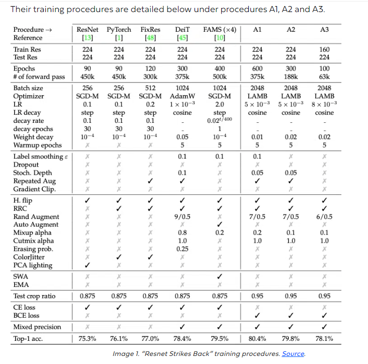
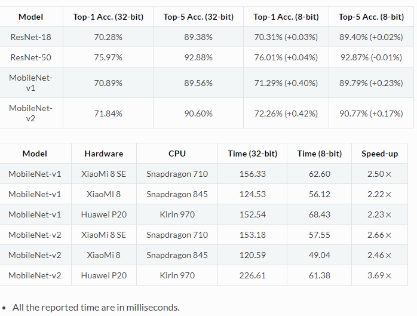

# RESNET 50 
 DATASET USED **IMAGENET**
Let us discuss the demonstration on how the techniques allowed us to achieve 81.9% Top 1 Accuracy on ImageNet with ResNet50, outperforming pre-existing SOTA results. 

Choosing the best neural network training recipe for deep learning models is challenging. A paper called “Resnet Strikes Back” demonstrated the significance of the right training for training ResNet50 on ImageNet. They boosted ResNet50 to a top-1 accuracy of 80.4% on ImageNet-1K. The original ResNet50 recipe reached 75.8% accuracy, so this improved. 
## Improving upon resnet strike back:
Knowledge Distillation. A training technique that trains small machine learning models to be as accurate as large models by transferring knowledge. Read more about knowledge distillation here.
We apply EMA. A method that increases the stability of a model’s convergence and helps it reach a better overall solution by preventing convergence to local minima. 
Weight averaging. Weight averaging is a post-training method that takes the best model weights across the training and averages them into a single model. 
We don’t apply stochastic depth. Stochastic depth aims to shrink the depth of a network by randomly removing/deactivating residual blocks during training.
We utilized several essential techniques outlined in this previous blog to improve the A1 recipe. 
## Steps for training resnet 50:
The training process we utilized comprises two key components: the data pipeline and the training hyperparameters.
Combining these data pipeline strategies and training hyperparameters, we could achieve a remarkable Top 1 Accuracy of 81.9% on ImageNet with ResNet50.
Reference:[https://deci.ai/blog/resnet50-how-to-achieve-sota-accuracy-on-imagenet/#:~:text=They%20boosted%20ResNet50%20to%20a,%25%20accuracy%2C%20so%20this%20improved.]

# MOBILENETV1

The original uncompressed MobileNet-v1's top-1 accuracy is 70.89%.

We can adopt ChannelPrunedLearner to shrink the number of channels for convolutional layers to reduce the computation complexity. Instead of using the same pruning ratio for all layers, we utilize the DDPG algorithm as the RL agent to iteratively search for the optimal pruning ratio of each layer. After obtaining the optimal pruning ratios, group fine-tuning is adopted to further improve the compressed model's accuracy, as demonstrated below:

We can adopt UniformQuantTFLearner to uniformly quantize model weights from 32-bit floating-point numbers to 8-bit fixed-point numbers. The resulting model can be converted into the TensorFlow Lite format for deployment on mobile devices. In the following two tables, we show that 8-bit quantized models can be as accurate as (or even better than) the original 32-bit ones, and the inference time can be significantly reduced after quantization.

Reference: [https://pocketflow.github.io/performance/#:~:text=Note%3A%20The%20original%20uncompressed%20MobileNet,%2D1%20accuracy%20is%2070.89%25.]

# VGG 16
## Limitations of VGG 16:

->It is very slow to train (the original VGG model was trained on Nvidia Titan GPU for 2-3 weeks).
->The size of VGG-16 trained imageNet weights is 528 MB. So, it takes quite a lot of disk space and bandwidth 
  which makes it inefficient.
->138 million parameters lead to exploding gradients problem.
->Resnets are introduced to prevent exploding gradients problem that occurred in VGG-16.
## Challenges of VGG 16:
->It is very slow to train (the original VGG model was trained on the Nvidia Titan GPU for 2–3 weeks).
->The size of VGG-16 trained imageNet weights is 528 MB. So, it takes quite a lot of disk space and bandwidth that 
 makes it inefficient.
 ### Pros:
 ~*->This network was a good introduction into the world of neural networks and is really simple to understand. It works well for character recognition images.*~
 ### Cons:
 ~*->This model was more specifcally built for a certain use case. While it was a major breakthrough in 1998, it does not do as well with color images. Most image recognition problems would require RGB images for better recognition.*~
~*->Since the model isn’t very deep, it struggles to scan for all features thus producing poor performing models. If the Neural Network isn’t fed with enough features from the training images then it would be difficult for the model to generalize and create an accurate model.*~

References: 
1. [https://pyimagesearch.com/2017/03/20/imagenet-vggnet-resnet-inception-xception-keras/#:~:text=Even%20though%20ResNet%20is%20much,down%20to%20102MB%20for%20ResNet50.]  
2.[https://medium.com/@mygreatlearning/everything-you-need-to-know-about-vgg16-7315defb5918]
3.[https://tejasmohanayyar.medium.com/a-practical-experiment-for-comparing-lenet-alexnet-vgg-and-resnet-models-with-their-advantages-d932fb7c7d17]

# DenseNet-101
